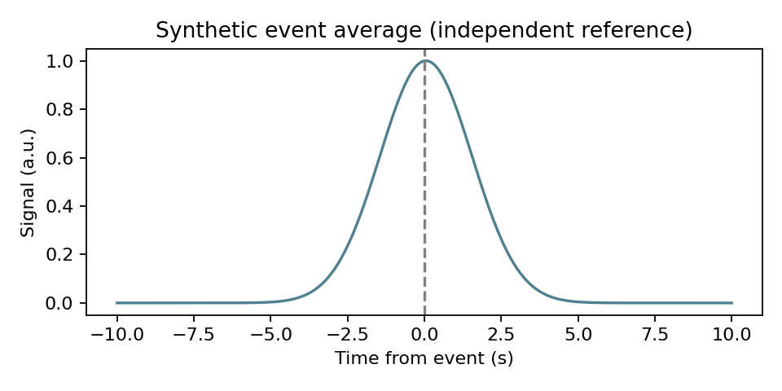

# Event extraction demonstration

Open run_example.m in MATLAB and press Run. Requires Signal Processing Toolbox. Expected output is a 401-by-3 epoch matrix, three included events and a relative-time vector -10:0.05:10.

The reference CSV and PNG were independently calculated in Python using the original function's indexing convention. The MATLAB wrapper has not been run here. Its original indexing produces a one-sample timeline offset relative to a zero-based signal; this reference preserves rather than fixes that behavior. This is a usage example, not timing validation.
