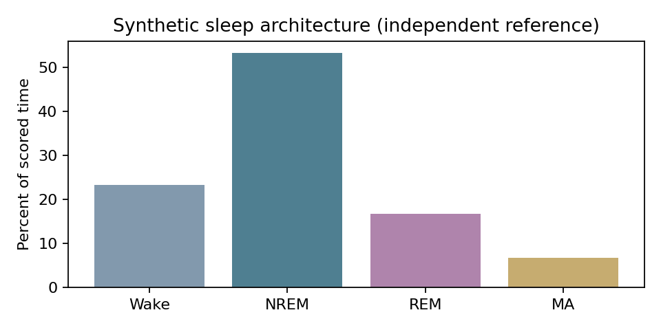

# Sleep architecture demonstration

Open `run_example.m` in MATLAB and press Run. It loads the included CSVs and calls the unchanged script. No paths need editing. Requires readmatrix (use a MATLAB release supporting it).

Expected totals: Wake 70 s, NREM 160 s, REM 50 s, MA 20 s. Percentages: 23.3333, 53.3333, 16.6667, 6.6667. MA rate is 24 per scored hour and 45 per NREM hour.

Reference CSV and PNG were computed independently in Python from these periods; the MATLAB wrapper has not been run here. Visual styling may differ. This example checks use and arithmetic only, not scoring validity.
